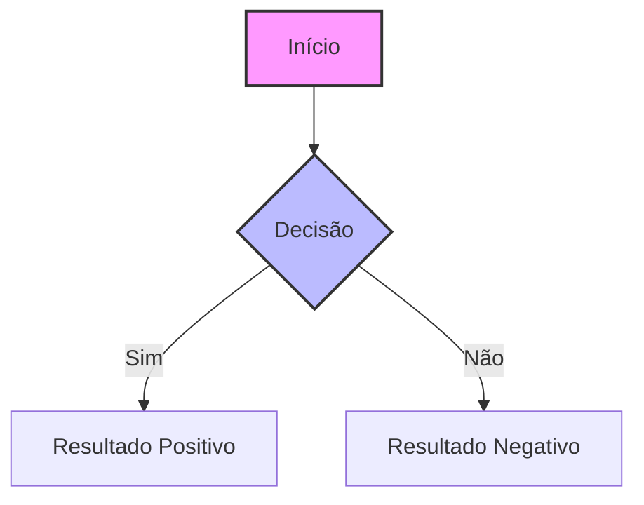
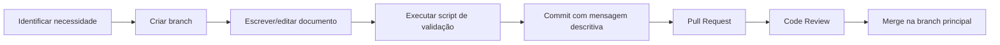

# Guia de Contribuição para a Documentação

Bem-vindo ao guia de contribuição para a documentação do projeto ControleDeGastos! Este documento descreve como contribuir, manter e melhorar a documentação do projeto.

## 🎯 Objetivo

Manter uma documentação de alta qualidade que:
1. **Eduque** novos membros da equipe
2. **Documente** decisões arquiteturais
3. **Facilite** manutenção e evolução
4. **Padronize** práticas de desenvolvimento

## 🏗️ Estrutura da Documentação

```
docs/
├── README.md                          # Ponto de entrada
├── CONTRIBUTING.md                    # Este arquivo
├── arquitetura/                       # Documentação arquitetural
│   ├── ARQUITETURA.md                 # Visão geral da arquitetura
│   └── DECISION_RECORDS.md            # Índice de ADRs
├── diagramas/                         # Diagramas e visualizações
│   ├── DIAGRAMAS_UML.md              # Diagramas UML em Mermaid
│   └── LEGENDA_DIAGRAMAS.md          # Legenda de símbolos
├── patterns/                          # Padrões de projeto
│   ├── PADROES_E_DECISOES.md         # Padrões aplicados
│   └── GUIDELINES_IMPLEMENTACAO.md   # Guias de implementação
├── decision-records/                  # Registros de decisão (ADRs)
│   ├── ADR-001-ARQUITETURA.md        # Decisão arquitetural 001
│   ├── ADR-002-PERSISTENCIA.md       # Decisão arquitetural 002
│   └── TEMPLATE_ADR.md               # Template para novos ADRs
├── guias/                            # Guias práticos
│   ├── SETUP_AMBIENTE.md             # Setup do ambiente
│   ├── CODING_STYLE.md               # Estilo de código
│   └── CODE_REVIEW.md                # Processo de code review
├── scripts/                          # Scripts de automação
│   └── update_docs.sh                # Script de manutenção
└── .gitignore                        # Arquivos ignorados no Git
```

## 📝 Tipos de Conteúdo

### 1. Documentação Arquitetural
**O que incluir**:
- Visão geral do sistema
- Decisões arquiteturais
- Diagramas de alto nível
- Padrões estabelecidos

**Exemplos**:
- `ARQUITETURA.md`
- `PADROES_E_DECISOES.md`

### 2. ADRs (Architectural Decision Records)
**O que incluir**:
- Contexto da decisão
- Alternativas consideradas
- Decisão tomada
- Consequências
- Status e histórico

**Template**: `decision-records/TEMPLATE_ADR.md`

### 3. Diagramas e Visualizações
**Formatos preferidos**:
- **Mermaid**: Para diagramas em Markdown
- **PlantUML**: Para diagramas mais complexos
- **Imagens**: PNG/SVG para diagramas exportados

**Diretório**: `diagramas/`

### 4. Guias Práticos
**O que incluir**:
- Passo-a-passo
- Exemplos de código
- Boas práticas
- Troubleshooting

**Exemplos**:
- Setup de ambiente
- Estilo de código
- Processos da equipe

## 🎨 Estilo e Formatação

### Markdown
```markdown
# Título Nível 1 (H1)

## Título Nível 2 (H2)

### Título Nível 3 (H3)

**Negrito** para ênfase

*Itálico* para termos técnicos

`código inline` para referências a código

```java
// Blocos de código com syntax highlighting
public class Exemplo {
    private String exemplo;
}
```

- Listas com marcadores
  1. Listas numeradas
  2. Para sequências

> Citações para notas importantes

[Links](https://exemplo.com) com URLs claras

 com texto alternativo
```

### Mermaid (Diagramas)


### Metadados
Incluir no final de cada documento:
```markdown
---
Última Atualização: YYYY-MM-DD
Versão: X.Y.Z
Responsável: [Nome/Role]
Status: [Ativo/Depreciado/Em Revisão]
Próxima Revisão: YYYY-MM-DD
---
```

## 🔄 Processo de Contribuição

### 1. Pré-requisitos
- Acesso ao repositório
- Conhecimento básico de Git
- Editor de texto/Markdown
- (Opcional) Ferramentas para diagramas

### 2. Fluxo de Trabalho


### 3. Criando uma Nova Branch
```bash
# Padrão de nome para branches de documentação
git checkout -b docs/tipo-descricao

# Exemplos:
git checkout -b docs/adicionar-guia-setup
git checkout -b docs/atualizar-diagramas-uml
git checkout -b docs/corrigir-links-quebrados
```

### 4. Mensagens de Commit
**Formato**: `tipo(escopo): descrição breve`

**Tipos**:
- `docs`: Documentação
- `feat`: Nova feature de documentação
- `fix`: Correção em documentação
- `update`: Atualização de conteúdo
- `refactor`: Reorganização/refatoração

**Exemplos**:
```
docs(arquitetura): adicionar diagrama de sequência
fix(links): corrigir links quebrados na ARQUITETURA.md
update(guias): atualizar guia de setup para Android Studio 2024
feat(adrs): adicionar ADR-003 para estratégia de UI
```

### 5. Pull Request
**Template**:
```markdown
## Tipo de Mudança
- [ ] Nova documentação
- [ ] Atualização de conteúdo
- [ ] Correção de erro
- [ ] Reorganização/refatoração

## Descrição
Breve descrição do que foi alterado e por quê.

## Documentos Alterados
- `docs/arquitetura/ARQUITETURA.md`
- `docs/diagramas/DIAGRAMAS_UML.md`

## Impacto
Como essa mudança afeta:
- [ ] Novos desenvolvedores
- [ ] Tomada de decisão
- [ ] Manutenção do código
- [ ] Outro: _____

## Checklist
- [ ] Conteúdo segue o estilo estabelecido
- [ ] Links foram verificados
- [ ] Timestamps foram atualizados
- [ ] Script de validação foi executado
- [ ] Revisão gramatical feita
- [ ] Metadados atualizados

## Screenshots (se aplicável)
Adicionar screenshots de diagramas ou visualizações.

## Referências
Link para issues, discussões ou outros PRs relacionados.
```

## 🧪 Validação e Qualidade

### Script de Validação
```bash
# Executar todas as verificações
./docs/scripts/update_docs.sh 3

# Ou apenas validação
./docs/scripts/update_docs.sh 2
```

### Critérios de Qualidade
1. **Completude**: Cobre todos os aspectos relevantes
2. **Clareza**: Linguagem acessível e direta
3. **Consistência**: Segue padrões estabelecidos
4. **Atualidade**: Reflete estado atual do projeto
5. **Precisão**: Informações técnicas corretas
6. **Utilidade**: Resolve problemas reais da equipe

### Code Review Checklist
- [ ] Conteúdo técnicamente correto
- [ ] Estilo consistente com outros documentos
- [ ] Links funcionam corretamente
- [ ] Diagramas são claros e precisos
- [ ] Metadados atualizados
- [ ] Sem informações duplicadas
- [ ] Nível de detalhe apropriado

## 🛠️ Ferramentas Recomendadas

### Editores Markdown
- **VS Code** com extensões Markdown
- **Typora** (editor dedicado)
- **Obsidian** (para conhecimento interligado)

### Diagramas
- **Mermaid Live Editor**: https://mermaid.live
- **PlantUML**: https://plantuml.com
- **Draw.io**: https://draw.io
- **Excalidraw**: https://excalidraw.com

### Validação
- **markdownlint**: Validação de estilo Markdown
- **Vale**: Validação de estilo de escrita
- **Script customizado**: `update_docs.sh`

## 📚 Recursos de Aprendizado

### Markdown
- [Guia Markdown](https://www.markdownguide.org)
- [Mermaid Documentation](https://mermaid.js.org)
- [GitHub Flavored Markdown](https://github.github.com/gfm/)

### Documentação Técnica
- [Documentation Guide](https://www.divio.com/blog/documentation/)
- [ADR GitHub](https://github.com/joelparkerhenderson/architecture-decision-record)
- [Google Technical Writing](https://developers.google.com/tech-writing)

### Boas Práticas
- [Write the Docs](https://www.writethedocs.org/guide/)
- [Diátaxis Framework](https://diataxis.fr/)
- [IBM Style Guide](https://www.ibm.com/docs/en/cloud-paks/cp-data/4.0?topic=writing-style-guidelines)

## 🚨 Problemas Comuns e Soluções

### 1. Links Quebrados
**Problema**: Links internos/externos não funcionam
**Solução**: Usar caminhos relativos e verificar com script

### 2. Conteúdo Desatualizado
**Problema**: Documentação não reflete código atual
**Solução**: Revisão trimestral e atualização após mudanças significativas

### 3. Inconsistência de Estilo
**Problema**: Diferentes padrões entre documentos
**Solução**: Seguir este guia e usar templates

### 4. Diagramas Complexos
**Problema**: Diagramas muito complexos ou confusos
**Solução**: Dividir em múltiplos diagramas, adicionar legendas

### 5. Duplicação de Conteúdo
**Problema**: Mesma informação em múltiplos lugares
**Solução**: Centralizar e fazer referência cruzada

## 🤝 Responsabilidades

### Mantenedores
- **Arquitetos**: Decisões arquiteturais, ADRs
- **Tech Leads**: Guias de implementação, padrões
- **Desenvolvedores**: Documentação de features específicas
- **Todos**: Manter documentos relacionados ao seu trabalho

### Revisores
- **Pares**: Code review de documentos
- **Especialistas**: Validação técnica
- **Stakeholders**: Validação de requisitos

### Schedule
- **Diariamente**: Atualizar documentos durante desenvolvimento
- **Semanalmente**: Revisão rápida de mudanças
- **Mensalmente**: Executar script de validação completo
- **Trimestralmente**: Revisão completa da documentação

## 📞 Suporte e Contato

### Canais
- **Issues GitHub**: Para bugs e melhorias
- **Pull Requests**: Para contribuições
- **Discussions**: Para dúvidas e sugestões
- **Code Reviews**: Para validação

### Responsáveis
- **Arquitetura**: [@arquitetura]
- **Documentação**: [@documentacao]
- **Desenvolvimento**: [@dev-team]

---

## 📊 Status da Documentação

| Área | Status | Última Revisão | Próxima Revisão | Responsável |
|------|--------|----------------|-----------------|-------------|
| Arquitetura | ✅ | Junho 2026 | Setembro 2026 | Arquitetura |
| Diagramas | ✅ | Junho 2026 | Setembro 2026 | Desenvolvimento |
| Padrões | ✅ | Junho 2026 | Setembro 2026 | Tech Leads |
| ADRs | ⚠️ | Junho 2026 | Julho 2026 | Arquitetura |
| Guias | 🔄 | - | Agosto 2026 | Desenvolvimento |

**Última Atualização deste Guia**: Junho 2026  
**Versão**: 1.0.0  
**Próxima Revisão**: Setembro 2026  

---

*Este documento é parte da documentação do projeto e deve ser mantido atualizado junto com as outras documentações.*