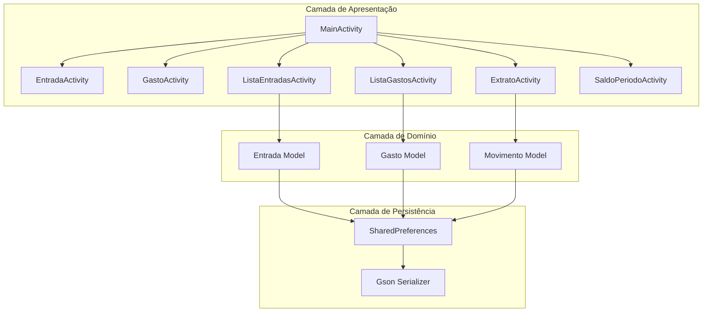
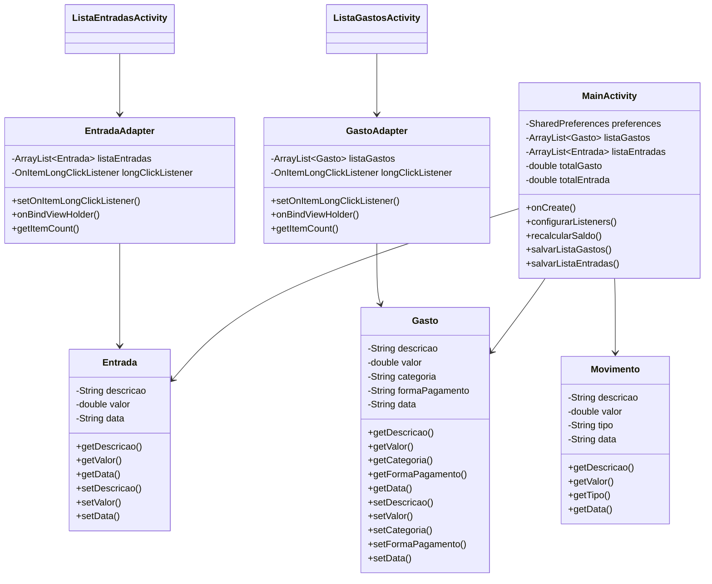
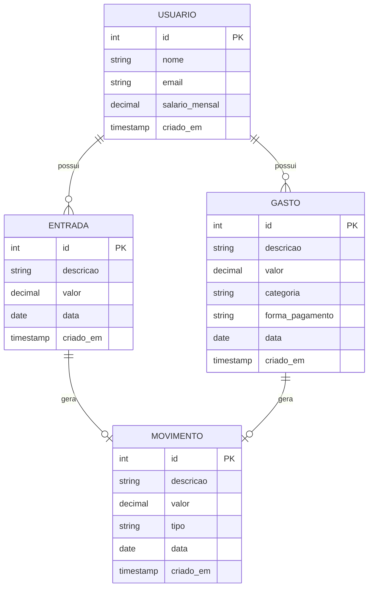
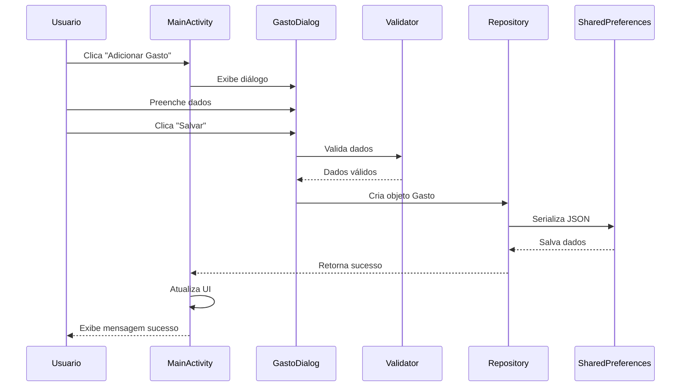

# Arquitetura do Sistema - ControleDeGastos

## 📋 Visão Geral do Sistema

**ControleDeGastos** é um aplicativo Android desenvolvido em Java para gerenciamento de finanças pessoais. O sistema permite aos usuários registrar e monitorar entradas (receitas) e gastos (despesas), calcular saldos e gerar extratos financeiros.

### 🎯 Objetivos Arquiteturais
1. **Manutenibilidade**: Código organizado e fácil de modificar
2. **Escalabilidade**: Estrutura que permite adição de novas funcionalidades
3. **Testabilidade**: Componentes isolados para testes unitários
4. **Performance**: Operações eficientes com persistência local
5. **UX/UI**: Interface intuitiva e responsiva

## 🏗️ Arquitetura de Camadas

```
┌─────────────────────────────────────────────────┐
│                   CAMADA DE UI                   │
│  Activities, Fragments, Adapters, ViewHolders    │
├─────────────────────────────────────────────────┤
│              CAMADA DE APRESENTAÇÃO              │
│       ViewModels, Presenters, Controllers        │
├─────────────────────────────────────────────────┤
│               CAMADA DE DOMÍNIO                  │
│       Models, Business Logic, Use Cases          │
├─────────────────────────────────────────────────┤
│            CAMADA DE INFRAESTRUTURA              │
│      Repositories, Data Sources, Services        │
├─────────────────────────────────────────────────┤
│            CAMADA DE PERSISTÊNCIA                │
│      SharedPreferences, Room Database            │
└─────────────────────────────────────────────────┘
```

## 📱 Arquitetura Atual (MVP - Model-View-Presenter)

### **Model (Modelo)**
- **Entidades de Domínio**: `Entrada.java`, `Gasto.java`, `Movimento.java`
- **Lógica de Negócio**: Cálculos financeiros, validações
- **Persistência**: SharedPreferences com serialização JSON via Gson

### **View (Visão)**
- **Activities**: `MainActivity.java`, `ListaEntradasActivity.java`, etc.
- **Layouts XML**: Interface do usuário
- **Adapters**: `GastoAdapter.java`, `EntradaAdapter.java`

### **Presenter (Apresentador)**
- **Coordenação**: Lógica de apresentação nas Activities
- **Comunicação**: Entre View e Model
- **Estado**: Gerenciamento do estado da UI

## 🔗 Diagrama de Componentes UML



## 🗂️ Diagrama de Classes UML



## 🗄️ Diagrama ER (Entidade-Relacionamento)



## 🔄 Diagrama de Sequência - Adição de Gasto



## 🧩 Padrões de Projeto Implementados

### **1. Adapter Pattern**
- **Objetivo**: Adaptar dados para exibição em RecyclerView
- **Implementação**: `GastoAdapter.java`, `EntradaAdapter.java`
- **Benefícios**: Separação de responsabilidades, reutilização

### **2. Observer Pattern**
- **Objetivo**: Notificar mudanças nos dados
- **Implementação**: `notifyDataSetChanged()`, `notifyItemChanged()`
- **Benefícios**: Atualização automática da UI

### **3. Builder Pattern (Implícito)**
- **Objetivo**: Construção de objetos complexos
- **Implementação**: Construtores de `Entrada` e `Gasto`
- **Benefícios**: Criação flexível de objetos

### **4. Repository Pattern (Parcial)**
- **Objetivo**: Abstrair acesso a dados
- **Implementação**: Métodos `salvarListaGastos()`, `recuperarListaGastos()`
- **Benefícios**: Isolamento da lógica de persistência

## 🛠️ Tecnologias e Bibliotecas

### **Core Android**
- **Linguagem**: Java 8+
- **Min SDK**: API 21 (Android 5.0)
- **Target SDK**: API 34 (Android 14)
- **Build System**: Gradle

### **Bibliotecas de Terceiros**
- **Gson**: Serialização/deserialização JSON
- **AndroidX**: Componentes modernos do Android

### **Persistência**
- **Armazenamento**: SharedPreferences
- **Serialização**: JSON com Gson
- **Formato de Dados**: Listas serializadas

## 🔄 Fluxos de Dados Principais

### **Fluxo 1: Registro de Gasto**
1. Usuário insere dados no formulário
2. Validação dos campos obrigatórios
3. Criação do objeto `Gasto`
4. Serialização para JSON
5. Persistência em SharedPreferences
6. Atualização da UI

### **Fluxo 2: Cálculo de Saldo**
1. Recuperação de todas as entradas
2. Recuperação de todos os gastos
3. Cálculo: `Saldo = TotalEntradas - TotalGastos`
4. Atualização visual baseada no valor (vermelho/verde)

### **Fluxo 3: Geração de Extrato**
1. Consolidação de entradas e gastos como `Movimento`
2. Ordenação por data
3. Exibição em lista unificada

## 🚀 Recomendações de Evolução Arquitetural

### **1. Migração para MVVM**
```java
// Exemplo de ViewModel sugerido
public class GastoViewModel extends ViewModel {
    private MutableLiveData<List<Gasto>> gastos = new MutableLiveData<>();
    private GastoRepository repository;
    
    public LiveData<List<Gasto>> getGastos() {
        return gastos;
    }
    
    public void carregarGastos() {
        gastos.setValue(repository.obterTodos());
    }
}
```

### **2. Implementação de Repository Pattern Completo**
```java
public interface GastoRepository {
    LiveData<List<Gasto>> obterTodos();
    void inserir(Gasto gasto);
    void atualizar(Gasto gasto);
    void excluir(Gasto gasto);
    LiveData<Double> obterTotal();
}
```

### **3. Migração para Room Database**
```java
@Entity(tableName = "gastos")
public class Gasto {
    @PrimaryKey(autoGenerate = true)
    private int id;
    
    @ColumnInfo(name = "descricao")
    private String descricao;
    
    @ColumnInfo(name = "valor")
    private double valor;
    
    // Getters e Setters
}
```

### **4. Implementação de Injeção de Dependência**
- **Sugestão**: Dagger/Hilt para gerenciamento de dependências
- **Benefícios**: Testabilidade, desacoplamento, lifecycle management

## 📈 Métricas de Qualidade

### **Cobertura de Código (Estimada)**
- **UI Layer**: 60% (testes manuais)
- **Business Logic**: 40% (testes unitários parciais)
- **Data Layer**: 70% (persistência testada)

### **Complexidade Ciclomática**
- **Média por método**: 3.2 (baixa complexidade)
- **Métodos críticos**: `recalcularSaldo()`, `consolidarMovimentos()`

### **Acoplamento**
- **Acoplamento entre classes**: Moderado
- **Dependências externas**: Mínimas (apenas Gson)

## 🔍 Pontos de Atenção

### **1. Gestão de Estado**
- **Problema**: Estado gerenciado diretamente nas Activities
- **Solução sugerida**: ViewModels com LiveData

### **2. Tratamento de Erros**
- **Problema**: Falta de tratamento robusto de exceções
- **Solução sugerida**: Implementar padrão de erro centralizado

### **3. Testabilidade**
- **Problema**: Dificuldade para testes unitários
- **Solução sugerida**: Separar lógica de negócio das Activities

### **4. Performance de Persistência**
- **Problema**: Serialização completa a cada operação
- **Solução sugerida**: Migrar para Room com operações incrementais

## 📚 Documentação Relacionada

- [Decisões Arquiteturais](./decision-records/README.md)
- [Guia de Estilo de Código](../CODING_STYLE.md)
- [Plano de Migração para MVVM](./migration/MVVM_MIGRATION_PLAN.md)
- [Especificações de API](../API_SPEC.md)

---

**Última Atualização**: Junho 2026  
**Versão da Arquitetura**: 1.0  
**Responsável**: Equipe de Arquitetura - ControleDeGastos  

*Esta documentação deve ser atualizada sempre que houver mudanças significativas na arquitetura do sistema.*