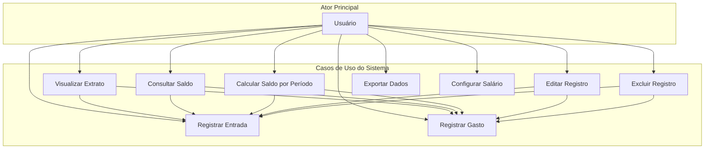
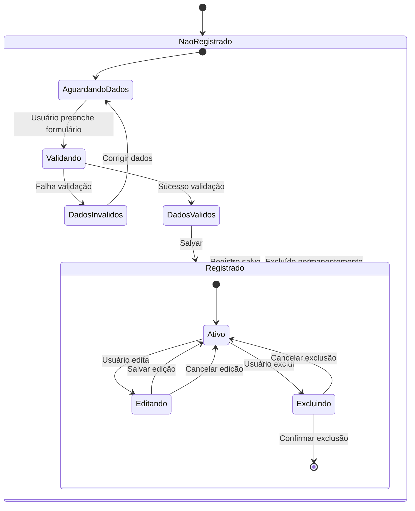
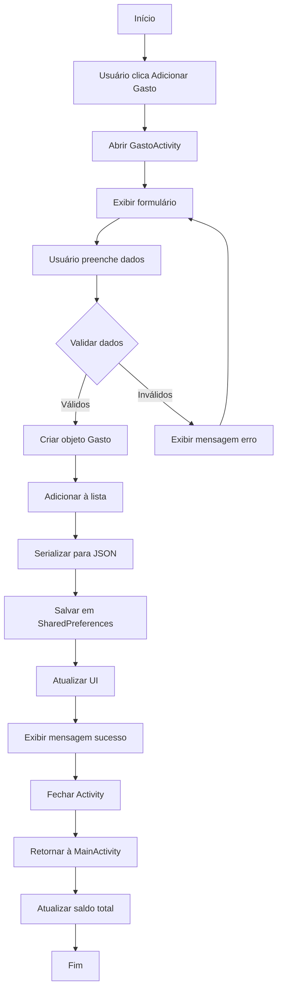
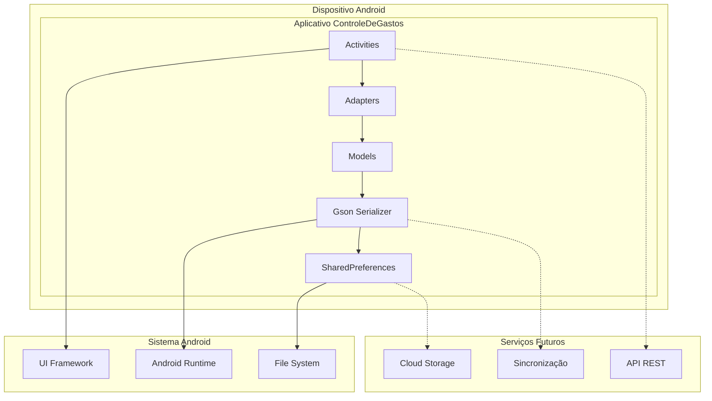
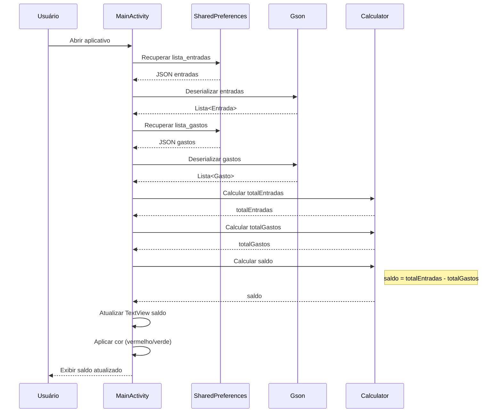
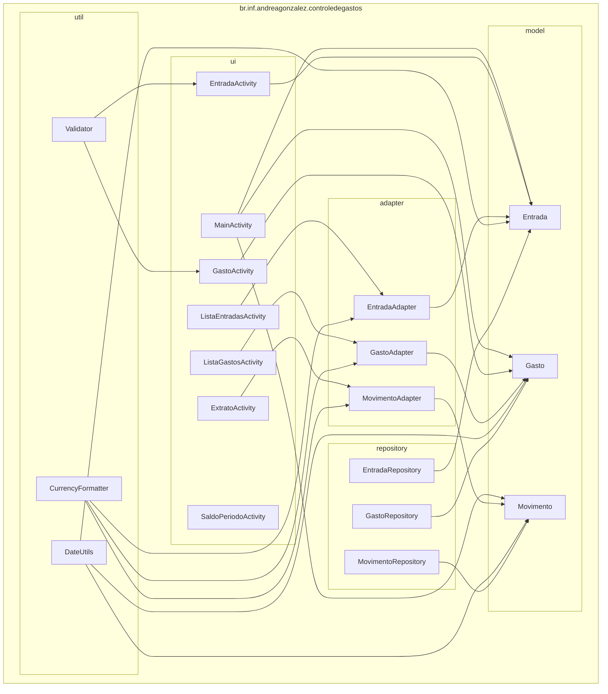
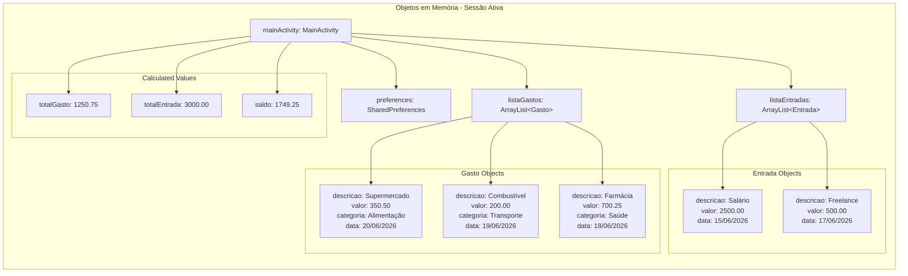
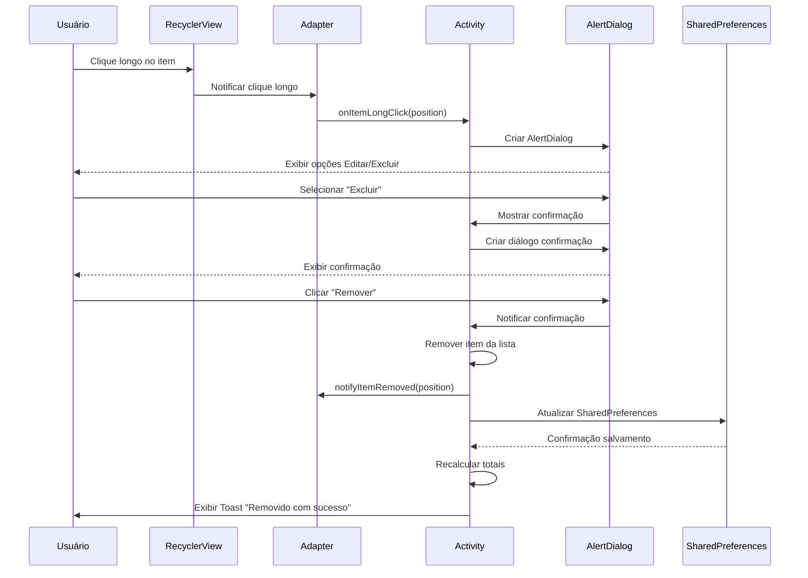
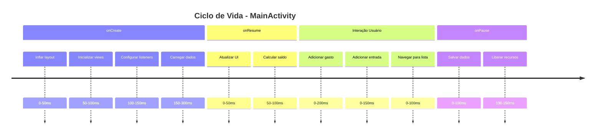

# Diagramas UML - ControleDeGastos

## 1. Diagrama de Casos de Uso

## 2. Diagrama de Classes Detalhado

```mermaid
classDiagram
    %% Entidades Principais
    class Entrada {
        -String descricao
        -double valor
        -String data
        -timestamp criadoEm
        +Entrada(descricao, valor, data)
        +getDescricao() String
        +getValor() double
        +getData() String
        +setDescricao(String)
        +setValor(double)
        +setData(String)
        +calcularImposto() double
        +validar() boolean
    }
    
    class Gasto {
        -String descricao
        -double valor
        -String categoria
        -String formaPagamento
        -String data
        -timestamp criadoEm
        +Gasto(descricao, valor, categoria, formaPagamento, data)
        +getDescricao() String
        +getValor() double
        +getCategoria() String
        +getFormaPagamento() String
        +getData() String
        +setDescricao(String)
        +setValor(double)
        +setCategoria(String)
        +setFormaPagamento(String)
        +setData(String)
        +categorizarAutomaticamente() String
        +validar() boolean
    }
    
    class Movimento {
        -String descricao
        -double valor
        -String tipo
        -String data
        -timestamp criadoEm
        +Movimento(descricao, valor, tipo, data)
        +getDescricao() String
        +getValor() double
        +getTipo() String
        +getData() String
        +formatarParaExibicao() String
        +eDespesa() boolean
        +eReceita() boolean
    }
    
    %% Activities
    class MainActivity {
        -SharedPreferences preferences
        -ArrayList~Gasto~ listaGastos
        -ArrayList~Entrada~ listaEntradas
        -ArrayList~Movimento~ listaMovimentos
        -double totalGasto
        -double totalEntrada
        -TextView textTotalGasto
        -TextView textSaldoRestante
        -Button btnAdicionarGasto
        -Button btnAdicionarEntrada
        +onCreate(Bundle)
        +onResume()
        +onPause()
        +configurarListeners()
        +adicionarGasto()
        +adicionarEntrada()
        +recalcularSaldo()
        +atualizarSaldo(double)
        +consolidarMovimentos()
        +formatarMoeda(double) String
        +salvarListaGastos()
        +salvarListaEntradas()
        +recuperarListaGastos()
        +recuperarListaEntradas()
    }
    
    class ListaGastosActivity {
        -RecyclerView recyclerGastos
        -GastoAdapter adapter
        -ArrayList~Gasto~ listaGastos
        -SharedPreferences preferences
        +onCreate(Bundle)
        +configurarRecyclerView()
        +mostrarOpcoesGasto(int)
        +editarGasto(int)
        +removerGasto(int)
        +salvarListaGastos()
        +recuperarListaGastos()
    }
    
    class ListaEntradasActivity {
        -RecyclerView recyclerEntradas
        -EntradaAdapter adapter
        -ArrayList~Entrada~ listaEntradas
        -SharedPreferences preferences
        +onCreate(Bundle)
        +configurarRecyclerView()
        +mostrarOpcoesEntrada(int)
        +editarEntrada(int)
        +removerEntrada(int)
        +salvarListaEntradas()
        +recuperarListaEntradas()
    }
    
    class GastoActivity {
        -EditText editDescricao
        -EditText editValor
        -Spinner spinnerCategoria
        -Spinner spinnerFormaPagamento
        -Button btnSalvar
        +onCreate(Bundle)
        +configurarSpinners()
        +validarFormulario() boolean
        +salvarGasto()
    }
    
    class EntradaActivity {
        -EditText editDescricao
        -EditText editValor
        -Button btnSalvar
        +onCreate(Bundle)
        +validarFormulario() boolean
        +salvarEntrada()
    }
    
    class ExtratoActivity {
        -RecyclerView recyclerMovimentos
        -MovimentoAdapter adapter
        -ArrayList~Movimento~ listaMovimentos
        +onCreate(Bundle)
        +carregarMovimentos()
        +ordenarPorData()
        +filtrarPorPeriodo(Date, Date)
        +calcularTotalPeriodo() double
    }
    
    class SaldoPeriodoActivity {
        -DatePicker dateInicio
        -DatePicker dateFim
        -TextView textResultado
        -Button btnCalcular
        +onCreate(Bundle)
        +calcularSaldoPeriodo()
        +validarPeriodo() boolean
        +formatarResultado(double) String
    }
    
    %% Adapters
    class GastoAdapter {
        <<interface>>
        +OnItemLongClickListener
        -ArrayList~Gasto~ listaGastos
        -OnItemLongClickListener longClickListener
        +GastoAdapter(ArrayList~Gasto~)
        +setOnItemLongClickListener(OnItemLongClickListener)
        +onCreateViewHolder(ViewGroup, int) GastoViewHolder
        +onBindViewHolder(GastoViewHolder, int)
        +getItemCount() int
        +formatarMoeda(double) String
    }
    
    class EntradaAdapter {
        <<interface>>
        +OnItemLongClickListener
        -ArrayList~Entrada~ listaEntradas
        -OnItemLongClickListener longClickListener
        +EntradaAdapter(ArrayList~Entrada~)
        +setOnItemLongClickListener(OnItemLongClickListener)
        +onCreateViewHolder(ViewGroup, int) EntradaViewHolder
        +onBindViewHolder(EntradaViewHolder, int)
        +getItemCount() int
        +formatarMoeda(double) String
    }
    
    class MovimentoAdapter {
        -ArrayList~Movimento~ listaMovimentos
        +MovimentoAdapter(ArrayList~Movimento~)
        +onCreateViewHolder(ViewGroup, int) MovimentoViewHolder
        +onBindViewHolder(MovimentoViewHolder, int)
        +getItemCount() int
        +formatarMoeda(double) String
        +obterCorPorTipo(String) int
    }
    
    %% ViewHolders
    class GastoViewHolder {
        -TextView textDescricao
        -TextView textCategoria
        -TextView textFormaPagamento
        -TextView textValor
        -TextView textData
        +GastoViewHolder(View)
    }
    
    class EntradaViewHolder {
        -TextView textDescricao
        -TextView textValor
        -TextView textData
        +EntradaViewHolder(View)
    }
    
    class MovimentoViewHolder {
        -TextView textDescricao
        -TextView textValor
        -TextView textTipo
        -TextView textData
        +MovimentoViewHolder(View)
    }
    
    %% Relacionamentos
    MainActivity --> Entrada
    MainActivity --> Gasto
    MainActivity --> Movimento
    ListaGastosActivity --> GastoAdapter
    ListaEntradasActivity --> EntradaAdapter
    ExtratoActivity --> MovimentoAdapter
    GastoAdapter --> Gasto
    GastoAdapter --> GastoViewHolder
    EntradaAdapter --> Entrada
    EntradaAdapter --> EntradaViewHolder
    MovimentoAdapter --> Movimento
    MovimentoAdapter --> MovimentoViewHolder
    GastoActivity --> Gasto
    EntradaActivity --> Entrada
```

## 3. Diagrama de Estados - Ciclo de Vida de um Registro

## 4. Diagrama de Atividades - Fluxo de Adição de Gasto

## 5. Diagrama de Componentes - Visão de Infraestrutura

## 6. Diagrama de Sequência - Cálculo de Saldo

## 7. Diagrama de Pacotes (Package Diagram)

## 8. Diagrama de Objetos - Estado do Sistema

## 9. Diagrama de Comunicação - Exclusão de Item

## 10. Diagrama de Tempo - Ciclo de Vida da Activity

---

## 📊 Legenda dos Diagramas

| Símbolo | Significado |
|---------|-------------|
| `<<interface>>` | Interface Java |
| `-` | Atributo privado |
| `+` | Método público |
| `#` | Método protegido |
| `~` | Atributo package-private |
| `-->` | Associação |
| `--|>` | Herança |
| `--o` | Agregação |
| `--*` | Composição |
| `-->` | Dependência |

## 🔧 Como Manter os Diagramas Atualizados

1. **Atualizar após mudanças arquiteturais**
2. **Revisar diagramas durante code reviews**
3. **Sincronizar com mudanças no código-fonte**
4. **Usar ferramentas como PlantUML para geração automática**

---

*Documentação gerada em: Junho 2026*  
*Última revisão: Versão 1.0*  
*Responsável: Arquitetura de Software - ControleDeGastos*